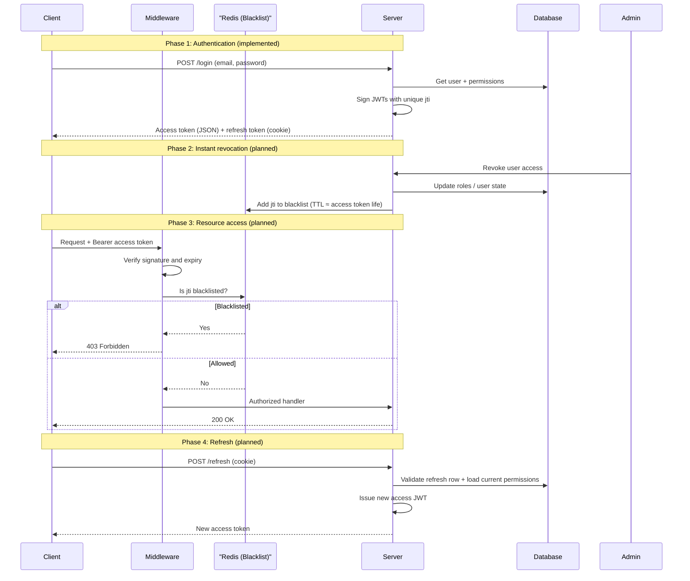

# Hybridgate

Hybridgate is a Go API that provides **authentication and role-based access control (RBAC)** for applications that need short-lived access tokens, refreshable sessions, and the ability to **revoke access quickly** without waiting for a JWT to expire.

The name reflects the idea of a **gate** between clients and protected resources: verify identity, attach permissions, issue credentials, and (planned) enforce revocation via a Redis-backed JWT blacklist keyed by `jti` (JWT ID).

## What we are building

Most apps need the same core auth story:

1. **Login** — verify email/password, load the user’s effective permissions from roles.
2. **Access** — send a short-lived **access token** (JWT) on each API call; embed permissions so services can authorize without hitting the DB every time.
3. **Refresh** — use a longer-lived **refresh token** to mint new access tokens when permissions may have changed.
4. **Revoke** — when an admin disables a user or changes roles, **invalidate active sessions immediately** by blacklisting the access token’s `jti` in Redis (TTL aligned with access token lifetime).

Hybridgate implements that model with:

| Piece | Technology | Role |
|--------|------------|------|
| API | [Gin](https://github.com/gin-gonic/gin) | HTTP routes and JSON responses |
| Identity store | SQLite | Users, roles, permissions, join tables, refresh token records |
| Session cache | Redis | (Planned) `jti` blacklist for instant revocation |
| Passwords | [argon2id](https://github.com/alexedwards/argon2id) | Secure password hashing |
| Tokens | [jwt/v5](https://github.com/golang-jwt/jwt) + [CUID](https://github.com/lucsky/cuid) | Signed JWTs with unique `jti` per token |
| IDs | CUID strings | Primary keys across users, roles, permissions, sessions |

### RBAC model

Permissions are fine-grained **slugs** (e.g. `file:read`, `file:write`, `admin:revoke`). Roles group permissions; users get one or more roles via join tables.

```
users ── user_roles ── roles ── role_permissions ── permissions
```

Access tokens carry the resolved permission list at login time. Refresh (planned) will re-query the database so permission changes take effect on the next access token.

### Token strategy

| Token | Lifetime | Delivery | Contents |
|--------|-----------|----------|----------|
| Access | 15 minutes | JSON response body | `sub` (user CUID), `email`, `permissions`, `jti`, `typ: access` |
| Refresh | 1 hour | `HttpOnly` cookie (`refresh_token`) | `sub`, `jti`, `typ: refresh`; row stored in `refresh_tokens` |

The refresh token is **not** returned in the login JSON body; it is set as a cookie scoped to `/api/v1/auth/refresh` so browsers can call a future refresh endpoint without exposing the token to JavaScript.

## Current status

**Implemented**

- SQLite schema and migrations-on-startup (`CREATE TABLE IF NOT EXISTS`)
- Seed script for roles, permissions, test users, and role mappings
- `POST /api/v1/auth/login` — Argon2id verify, permission load, JWT issue, refresh cookie
- Redis client initialization (ready for blacklist middleware)
- Dev workflow with [Air](https://github.com/air-verse/air) hot reload

**Planned** (see sequence diagram below)

- Auth middleware (JWT verify + Redis `jti` check)
- `POST /api/v1/auth/refresh`
- Admin revocation (DB role change + Redis blacklist)
- Protected resource routes

## Architecture



## Project layout

```
hybridgate/
├── cmd/api/              # HTTP server entrypoint
├── internal/
│   ├── auth/             # Login, JWT, repository queries
│   └── platform/
│       ├── database/     # SQLite connection and schema
│       └── redis/        # Redis client
├── seed.go               # RBAC + user seed script
├── .air.toml             # Live reload config
├── .env.example          # Environment template (commit this)
└── hybridgate.db         # Local SQLite file (gitignored)
```

## Requirements

- Go 1.25+
- SQLite3 (CGO — Xcode CLI tools on macOS)
- Redis (for blacklist once middleware lands; required at startup today)

## Getting started

### 1. Clone and configure environment

```bash
cp .env.example .env
```

Edit `.env`:

```bash
REDIS_URL=redis://localhost:6379/0
JWT_SECRET=your-long-random-secret
```

`JWT_SECRET` must be set; the server uses it to sign and verify JWTs.

### 2. Seed the database

Creates tables (if missing) and inserts default roles, permissions, and users.

```bash
go run seed.go
```

Optional custom DB path:

```bash
go run seed.go -db hybridgate.db
```

If you change the schema, delete the local DB and re-seed:

```bash
rm -f hybridgate.db && go run seed.go
```

### 3. Run the API

With Air (recommended):

```bash
air
```

Or directly:

```bash
go run ./cmd/api
```

Server listens on **`:8080`**. Air loads variables from `.env` via `env_files` in `.air.toml`.

## Seed data

All seeded users share the password **`password123`**.

| Email | Role | Permissions |
|--------|------|-------------|
| admin@test.com | Admin | `file:read`, `file:write`, `admin:revoke` |
| manager@test.com | Manager | `file:read`, `file:write` |
| guest@test.com | Viewer | `file:read` |

## API

### Health check

```http
GET /api/v1/auth/ping
```

### Login

```http
POST /api/v1/auth/login
Content-Type: application/json

{
  "email": "admin@test.com",
  "password": "password123"
}
```

**Success (200)**

```json
{
  "ok": true,
  "message": "login successful",
  "data": {
    "access_token": "<jwt>",
    "expires_in": 900,
    "permissions": ["admin:revoke", "file:read", "file:write"]
  }
}
```

Also sets an `HttpOnly` cookie:

- Name: `refresh_token`
- Path: `/api/v1/auth/refresh`
- Max-Age: 1 hour

**Errors**

- `400` — validation failed
- `401` — invalid credentials
- `500` — server error (e.g. missing `JWT_SECRET`, database/Redis failure)

### Example

```bash
curl -s -X POST http://localhost:8080/api/v1/auth/login \
  -H 'Content-Type: application/json' \
  -d '{"email":"admin@test.com","password":"password123"}' | jq
```

## Security notes

- Never commit `.env` or `*.db` files (see `.gitignore`).
- Use a strong `JWT_SECRET` in production and run HTTPS so cookies can use `Secure`.
- Access tokens embed permissions at issue time; refresh/re-auth is required after role changes until refresh is implemented.
- `jti` in each JWT supports O(1) revocation checks in Redis once middleware is added.

## License

Private / unlicensed unless otherwise specified by the repository owner.
