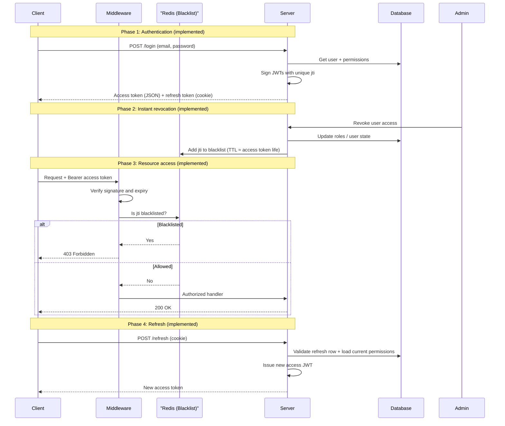

# Hybridgate

Hybridgate is a Go API that handles **authentication and role-based access control (RBAC)** for applications that need short-lived access tokens, refreshable sessions, and the ability to **revoke access instantly** — without sitting around waiting for a JWT to expire naturally.

The name reflects the core idea: a **gate** between clients and protected resources. Verify identity, attach permissions, issue credentials, and enforce revocation via a Redis-backed JWT blacklist keyed by `jti` (JWT ID).

## The problem it solves

Most apps need the same core auth story:

1. **Login** — verify email/password, load the user's effective permissions from their roles.
2. **Access** — attach a short-lived **access token** (JWT) to each API call; embed permissions so downstream services can authorize without hitting the DB every time.
3. **Refresh** — use a longer-lived **refresh token** to mint new access tokens, picking up any permission changes in the process.
4. **Revoke** — when an admin disables a user or changes roles, **invalidate active sessions immediately** by blacklisting the access token's `jti` in Redis (TTL aligned with the access token lifetime).

Hybridgate implements that model with:

| Piece | Technology | Role |
|--------|------------|------|
| API | [Gin](https://github.com/gin-gonic/gin) | HTTP routes and JSON responses |
| Identity store | SQLite | Users, roles, permissions, join tables, refresh token records |
| Session cache | Redis | `jti` blacklist + per-user revocation flags |
| Passwords | [argon2id](https://github.com/alexedwards/argon2id) | Secure password hashing |
| Tokens | [jwt/v5](https://github.com/golang-jwt/jwt) + [CUID](https://github.com/lucsky/cuid) | Signed JWTs with unique `jti` per token |
| IDs | CUID strings | Primary keys across users, roles, permissions, sessions |

### RBAC model

Permissions are fine-grained **slugs** (e.g. `file:read`, `file:write`, `admin:revoke`). Roles group permissions; users get one or more roles via join tables.

```
users ── user_roles ── roles ── role_permissions ── permissions
```

Access tokens carry permissions at issue time. **Refresh** re-queries the database so role changes take effect on the next access token — no need to force a full re-login.

### Token strategy

| Token | Lifetime | Delivery | Contents |
|--------|-----------|----------|----------|
| Access | 15 minutes | JSON response body | `sub` (user CUID), `email`, `permissions`, `jti`, `typ: access` |
| Refresh | 1 hour | `HttpOnly` cookie (`refresh_token`) | `sub`, `jti`, `typ: refresh`; row stored in `refresh_tokens` |

The refresh token is **not** included in the login JSON body — it's set as a cookie scoped to `/api/v1/auth/refresh`, so browsers can silently refresh without ever exposing the token to JavaScript.

## Current status

**Implemented**

- SQLite RBAC schema + seed script
- **Phase 1 — Login:** `POST /api/v1/auth/login` (Argon2id, JWT + refresh cookie)
- **Phase 2 — Revocation:** `POST /api/v1/auth/revoke` (admin only — strips roles, revokes refresh tokens, Redis user block)
- **Phase 3 — Middleware:** JWT verify, Redis `jti` blacklist, permission checks, `GET /api/v1/files`
- **Phase 4 — Refresh:** `POST /api/v1/auth/refresh` (cookie-based, reloads permissions from DB)
- **Logout:** `POST /api/v1/auth/logout` (blacklist access `jti`, revoke refresh)
- OpenAPI 3 spec (`openapi.yaml`) for Bruno, Postman, Insomnia
- Dev workflow with [Air](https://github.com/air-verse/air) hot reload

## Architecture



## Project layout

```
hybridgate/
├── cmd/api/              # HTTP server entrypoint
├── internal/
│   ├── auth/             # Login, JWT, repository queries
│   └── platform/
│       ├── database/     # SQLite connection and schema
│       └── redis/        # Redis client
├── seed.go               # RBAC + user seed script
├── openapi.yaml          # OpenAPI 3 spec (import into Bruno, Postman, Insomnia)
├── .air.toml             # Live reload config
├── .env.example          # Environment template (commit this)
└── hybridgate.db         # Local SQLite file (gitignored)
```

## Requirements

- Go 1.25+
- SQLite3 (CGO — Xcode CLI tools on macOS)
- Redis (required — `jti` blacklist and user revocation flags)

## Getting started

### 1. Clone and configure environment

```bash
cp .env.example .env
```

Edit `.env`:

```bash
REDIS_URL=redis://localhost:6379/0
JWT_SECRET=your-long-random-secret
```

`JWT_SECRET` must be set; the server uses it to sign and verify all JWTs.

### 2. Seed the database

Creates tables (if missing) and inserts default roles, permissions, and users.

```bash
go run seed.go
```

Optional custom DB path:

```bash
go run seed.go -db hybridgate.db
```

If you change the schema, delete the local DB and re-seed:

```bash
rm -f hybridgate.db && go run seed.go
```

### 3. Start Redis (if needed)

```bash
docker run -d --name hybridgate-redis -p 6379:6379 redis:7-alpine
```

### 4. Run the API

With Air (recommended — loads `.env` automatically):

```bash
air
```

Or directly (load env vars first):

```bash
export $(grep -v '^#' .env | xargs) && go run ./cmd/api
```

Server listens on **`:8080`**.

## Seed data

All seeded users share the password **`password123`**.

| Email | Role | Permissions |
|--------|------|-------------|
| admin@test.com | Admin | `file:read`, `file:write`, `admin:revoke` |
| manager@test.com | Manager | `file:read`, `file:write` |
| guest@test.com | Viewer | `file:read` |

## API documentation

The full contract lives in **[`openapi.yaml`](openapi.yaml)** (OpenAPI 3.0).

### Import into an API client

| Client | Steps |
|--------|--------|
| [Bruno](https://www.usebruno.com/) | Open Collection → Import → OpenAPI → select `openapi.yaml` |
| Postman | Import → OpenAPI 3 → select `openapi.yaml` |
| Insomnia | Application → Import → From File → `openapi.yaml` |

Set the server URL to `http://localhost:8080`, then run **Ping** and **Login**.

### Endpoints

| Method | Path | Auth | Permission | Description |
|--------|------|------|------------|-------------|
| `GET` | `/api/v1/auth/ping` | — | — | Health check |
| `POST` | `/api/v1/auth/login` | — | — | Login; access token in JSON, refresh in cookie |
| `POST` | `/api/v1/auth/refresh` | Cookie | — | New access token (fresh permissions) |
| `POST` | `/api/v1/auth/logout` | Bearer | — | Blacklist `jti`, clear refresh cookie |
| `POST` | `/api/v1/auth/revoke` | Bearer | `admin:revoke` | Revoke a user's roles and sessions |
| `GET` | `/api/v1/files` | Bearer | `file:read` | Example protected resource |

### Quick test (curl)

```bash
BASE=http://localhost:8080

# Ping
curl -s $BASE/api/v1/auth/ping | jq

# Login (admin) — save token
TOKEN=$(curl -s -c /tmp/hg-cookies.txt -X POST $BASE/api/v1/auth/login \
  -H 'Content-Type: application/json' \
  -d '{"email":"admin@test.com","password":"password123"}' | jq -r '.data.access_token')

# Protected files (requires file:read)
curl -s $BASE/api/v1/files -H "Authorization: Bearer $TOKEN" | jq

# Refresh (uses cookie from login)
curl -s -b /tmp/hg-cookies.txt -c /tmp/hg-cookies.txt -X POST $BASE/api/v1/auth/refresh | jq

# Revoke manager (admin only)
curl -s -X POST $BASE/api/v1/auth/revoke \
  -H "Authorization: Bearer $TOKEN" \
  -H 'Content-Type: application/json' \
  -d '{"email":"manager@test.com"}' | jq

# Logout
curl -s -b /tmp/hg-cookies.txt -X POST $BASE/api/v1/auth/logout \
  -H "Authorization: Bearer $TOKEN" | jq
```

Full request/response schemas: [`openapi.yaml`](openapi.yaml).

## Security notes

- Never commit `.env` or `*.db` files (see `.gitignore`).
- Use a strong `JWT_SECRET` in production and run HTTPS so cookies can use `Secure`.
- Access tokens embed permissions at issue time; call **refresh** after role changes to pick up updated permissions.
- Admin **revoke** strips roles and blocks the user in Redis for the access-token TTL (15 min).
- `jti` blacklist on logout blocks a specific access token immediately, no waiting for expiry.

## License

Private / unlicensed unless otherwise specified by the repository owner.
