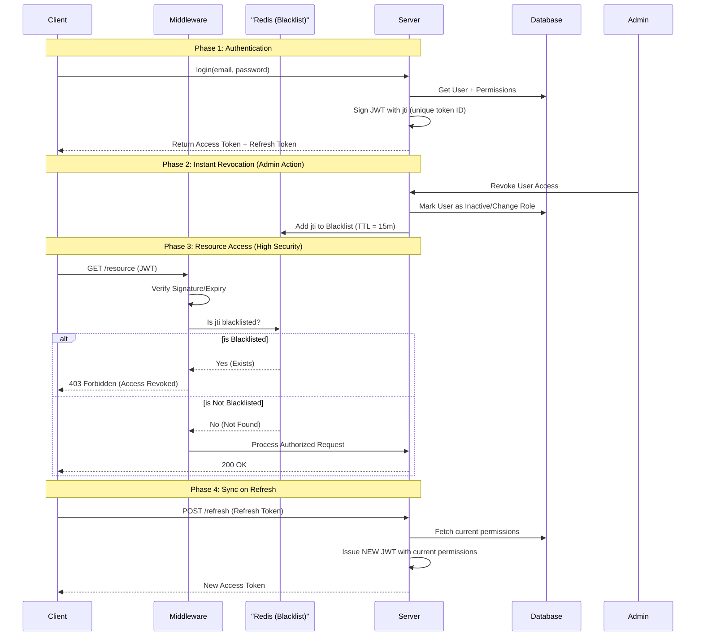

# Hybridgate

Auth flow (sequence diagram). Renders on GitHub; in Cursor/VS Code use the built-in Markdown preview or a Mermaid extension if needed.

```mermaid
sequenceDiagram
    participant Client
    participant Middleware
    participant RedisBlacklist as "Redis (Blacklist)"
    participant Server
    participant Database
    participant Admin

    Note over Client, Server: Phase 1: Authentication
    Client->>Server: login(email, password)
    Server->>Database: Get User + Permissions
    Server->>Server: Sign JWT with jti (unique token ID)
    Server-->>Client: Return Access Token + Refresh Token

    Note over Client, Server: Phase 2: Instant Revocation (Admin Action)
    Admin->>Server: Revoke User Access
    Server->>Database: Mark User as Inactive/Change Role
    Server->>RedisBlacklist: Add jti to Blacklist (TTL = 15m)

    Note over Client, Server: Phase 3: Resource Access (High Security)
    Client->>Middleware: GET /resource (JWT)
    Middleware->>Middleware: Verify Signature/Expiry
    Middleware->>RedisBlacklist: Is jti blacklisted?

    alt is Blacklisted
        RedisBlacklist-->>Middleware: Yes (Exists)
        Middleware-->>Client: 403 Forbidden (Access Revoked)
    else is Not Blacklisted
        RedisBlacklist-->>Middleware: No (Not Found)
        Middleware->>Server: Process Authorized Request
        Server-->>Client: 200 OK
    end

    Note over Client, Server: Phase 4: Sync on Refresh
    Client->>Server: POST /refresh (Refresh Token)
    Server->>Database: Fetch current permissions
    Server->>Server: Issue NEW JWT with current permissions
    Server-->>Client: New Access Token
```
